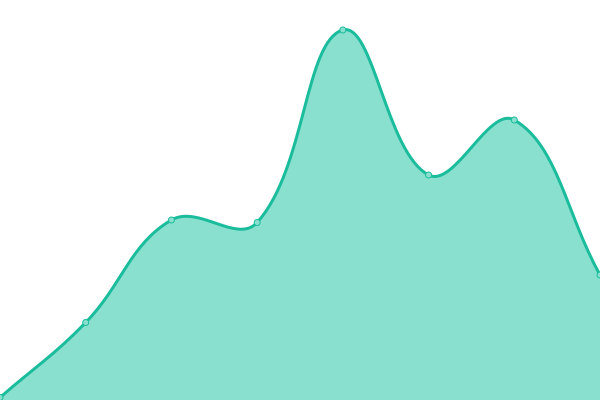
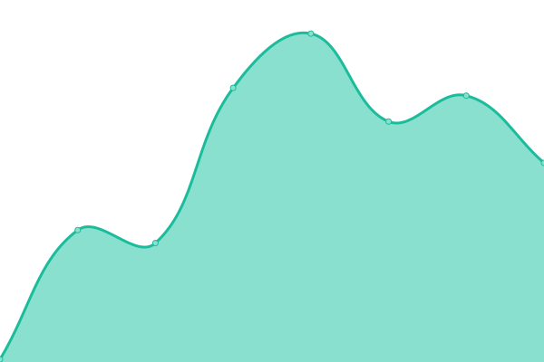

# [📈 Live Status](https://NFTfi-Genesis.github.io/nftfi-services-status): <!--live status--> **🟧 Partial outage**

This repository contains the open-source uptime monitor and status page for [NFTfi-Genesis](https://NFTfi-Genesis.github.io/nftfi-services-status), powered by [Upptime](https://github.com/upptime/upptime).

With [Upptime](https://upptime.js.org), you can get your own unlimited and free uptime monitor and status page, powered entirely by a GitHub repository. We use [Issues](https://github.com/NFTfi-Genesis/nftfi-services-status/issues) as incident reports, [Actions](https://github.com/NFTfi-Genesis/nftfi-services-status/actions) as uptime monitors, and [Pages](https://NFTfi-Genesis.github.io/nftfi-services-status) for the status page.

<!--start: status pages-->
<!-- This summary is generated by Upptime (https://github.com/upptime/upptime) -->
<!-- Do not edit this manually, your changes will be overwritten -->
<!-- prettier-ignore -->
| URL | Status | History | Response Time | Uptime |
| --- | ------ | ------- | ------------- | ------ |
|  [NFTfi](https://nftfi.com) | 🟩 Up | [nf-tfi.yml](https://github.com/NFTfi-Genesis/nftfi-services-status/commits/HEAD/history/nf-tfi.yml) | 

 915ms
     
 | 

<a href="https://NFTfi-Genesis.github.io/nftfi-services-status/history/nf-tfi">100.00%</a>
    

|  [dApp](https://app.nftfi.com) | 🟥 Down | [d-app.yml](https://github.com/NFTfi-Genesis/nftfi-services-status/commits/HEAD/history/d-app.yml) | 

 410ms
     
 | 

<a href="https://NFTfi-Genesis.github.io/nftfi-services-status/history/d-app">96.26%</a>
    

|  [API](https://api.nftfi.com) | 🟩 Up | [api.yml](https://github.com/NFTfi-Genesis/nftfi-services-status/commits/HEAD/history/api.yml) | 

 810ms
     
 | 

<a href="https://NFTfi-Genesis.github.io/nftfi-services-status/history/api">98.52%</a>
    

|  [SDK API /listings](https://sdk-api.nftfi.com/listings) | 🟩 Up | [sdk-api-listings.yml](https://github.com/NFTfi-Genesis/nftfi-services-status/commits/HEAD/history/sdk-api-listings.yml) | 

 451ms
     
 | 

<a href="https://NFTfi-Genesis.github.io/nftfi-services-status/history/sdk-api-listings">99.86%</a>
    

|  [SDK API /loans](https://sdk-api.nftfi.com/loans) | 🟩 Up | [sdk-api-loans.yml](https://github.com/NFTfi-Genesis/nftfi-services-status/commits/HEAD/history/sdk-api-loans.yml) | 

 418ms
     
 | 

<a href="https://NFTfi-Genesis.github.io/nftfi-services-status/history/sdk-api-loans">99.86%</a>
    

|  [SDK API /offers](https://sdk-api.nftfi.com/offers) | 🟩 Up | [sdk-api-offers.yml](https://github.com/NFTfi-Genesis/nftfi-services-status/commits/HEAD/history/sdk-api-offers.yml) | 

 374ms
     
 | 

<a href="https://NFTfi-Genesis.github.io/nftfi-services-status/history/sdk-api-offers">99.86%</a>
    

|  [SDK API /authorization/token](https://sdk-api.nftfi.com/authorization/token) | 🟩 Up | [sdk-api-authorization-token.yml](https://github.com/NFTfi-Genesis/nftfi-services-status/commits/HEAD/history/sdk-api-authorization-token.yml) | 

 456ms
     
 | 

<a href="https://NFTfi-Genesis.github.io/nftfi-services-status/history/sdk-api-authorization-token">99.86%</a>
    

<!--end: status pages-->

[**Visit our status website →**](https://NFTfi-Genesis.github.io/nftfi-services-status)

## 📄 License

- Powered by: [Upptime](https://github.com/upptime/upptime)
- Code: [MIT](./LICENSE) © [NFTfi-Genesis](https://NFTfi-Genesis.github.io/nftfi-services-status)
- Data in the `./history` directory: [Open Database License](https://opendatacommons.org/licenses/odbl/1-0/)
